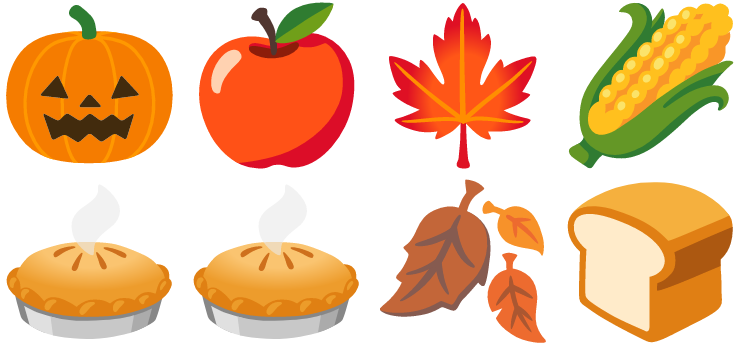

# Zipping collections with Groovy

A Groovy solution inspired by:
https://donraab.medium.com/make-or-append-me-a-string-c654f247373a

Related blog post:
https://blogs.apache.org/groovy/entry/zipping-collections-with-groovy